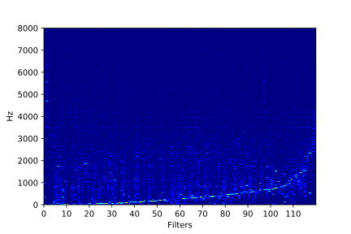

# End-to-end learning for a music audio tagging task
This is a PyTorch implementation of ["End-to-end learning for music audio"](https://ieeexplore.ieee.org/abstract/document/6854950) by [Dieleman and Schrauwen (2014)](#References).

My aim was mostly to learn and play with the model, and to visualise the filters, so the implementation is currently not complete. The code  does not for example average predictions over a track to display AUC scores. I plan to add this later. It also uses all the tagging classes, not the top 50.

## Usage
Download and prepare the data by running `get_data.sh`. The remaining code is in `visualise.ipynb`. It should produce figures such as the following:

## Data
[MagnaTagATune dataset](http://mirg.city.ac.uk/codeapps/the-magnatagatune-dataset)

## References
- Dieleman, S. and Schrauwen, B., 2014, May. [End-to-end learning for music audio](https://ieeexplore.ieee.org/abstract/document/6854950). In 2014 IEEE International Conference on Acoustics, Speech and Signal Processing (ICASSP) (pp. 6964-6968). IEEE.
